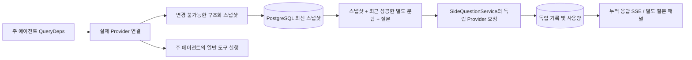

# ARTEX의 별도 질문 `/btw`

일반 대화, 작업의 주 에이전트, 현재 작업의 실행 에이전트에서 원래 작업을 중단하지 않고 별도 질문을 할 수 있습니다. 주 입력창에 `/btw 질문`을 입력하세요. 질문 없이 `/btw`를 입력하거나 별도 질문 버튼을 누르면 기록을 엽니다. 데스크톱은 너비 조절 사이드 패널, 모바일은 서랍형 패널을 사용합니다.

답변은 질문을 제출한 시점의 에이전트 컨텍스트 스냅샷을 바탕으로 생성하며 스트리밍, 후속 질문, 중지, 기록 삭제를 지원합니다. 패널을 닫거나 새로고침하거나 SSE가 끊겨도 모델 요청은 취소되지 않습니다. 중지는 현재 별도 질문에만 적용됩니다. 기록을 비우면 별도 요청을 취소하고 질문 기록을 삭제하지만 주 컨텍스트 스냅샷은 유지합니다.

## 실행 경계

기존 Go, norma, Next.js 및 Markdown / ResizablePanel / Drawer / AlertDialog 구성요소를 사용합니다. 별도 질문을 위해 norma를 수정하거나 의존성을 추가하지 않습니다. 계획 에이전트와 다른 작업에서 상속한 실행 에이전트는 이 기능의 대상이 아닙니다.

`capture.go`는 `Options.Deps.CallModel / CallModelSync`의 주 실행 요청만 표시합니다. Provider 래퍼는 모델 풀에서 실제 공급자를 선택한 뒤 적용되므로 실제 선택된 모델을 기록합니다. 압축·요약 요청은 주 스냅샷을 덮어쓰지 않습니다.

요청 시작, 완전한 모델 응답, 실행 종료 상태에서 스냅샷을 발행합니다. 생성 중인 일부 응답은 발행하지 않습니다. `MessagesForAPI`로 도구 호출·결과의 짝을 유지하고, 도구 결과는 다음 주 모델 요청 또는 실행 종료 시 스냅샷에 포함됩니다. 스트리밍 중단 시 이전의 유효한 경계를 유지합니다.

스냅샷은 JSON 깊은 복사로 메시지, 시스템 지침, 도구 정의, 생성 매개변수를 보존합니다. 모델 실행 중 스냅샷 잠금이나 DB 트랜잭션을 유지하지 않습니다.

`SideQuestionService`는 선택된 Provider를 직접 호출합니다. 필요하면 별도 요약을 먼저 만들고, 최종 답변의 첫 요청이 컨텍스트 초과이며 아직 텍스트나 도구 호출을 반환하지 않았을 때에만 입력을 줄여 한 번 재시도합니다. 에이전트 세션이나 도구 실행기를 만들지 않고 주 transcript, 활동 피드, 작업 그래프 또는 작업 모델 전환 체인을 사용하지 않습니다. 구조화된 기존 도구 컨텍스트를 전달하기 위해 답변 요청에는 도구 정의가 남을 수 있지만, 새 도구 호출을 실행하는 경로는 없습니다. 요약 요청에는 도구를 제공하지 않습니다.

부모 세션당 한 요청, 서비스 프로세스 전체에서 최대 네 요청을 동시에 실행하며 단일 요청 제한 시간은 120초입니다. 서비스 수명 주기에 연결한 독립 취소 컨텍스트를 사용합니다. 모델 설정 ID와 비민감 식별 요약만 보관하고 자격증명은 요청 시 기존 설정에서 가져옵니다. 설정이 삭제되거나 모델·프로토콜·주소가 바뀌면 주 에이전트를 다시 실행하여 스냅샷을 갱신해야 합니다.

## 저장과 복원

`side_question_sessions`는 부모 리소스, 최신 스냅샷, 실행 ID, 버전, 정리 버전을 저장합니다. `side_question_requests`는 질문, 누적 답변, 상태, 모델, 스냅샷 시각, 사용량, 이벤트 및 페이지 순번을 저장합니다.

부모 키는 conversation ID 또는 task ID + exploration ID + intent ID입니다. 재사용되는 Worker 실행 슬롯 이름을 식별자로 사용하지 않습니다.

부모별 스냅샷 쓰기는 250ms마다 합치고 `(run_id, version)` 비교로 과거 버전의 덮어쓰기를 막습니다. 질문 제출 전 선택한 스냅샷을 다시 저장합니다. 저장 성공 후 메모리의 큰 스냅샷을 해제하고 실패 시 보류본을 유지합니다. 누적 답변도 스트리밍 중에는 최대 250ms에 한 번 쓰며, 종료 상태는 즉시 저장하고 DB 오류 시 제한된 재시도를 수행합니다.

서비스 시작 시 남은 `running` 요청은 `interrupted`로 표시하고 저장된 부분 답변과 사용량을 유지합니다. 요청을 자동 재실행하지 않습니다. 최근 저장된 컨텍스트로 다음 질문을 이어갈 수 있으며, 스냅샷이 없는 기존 대화는 주 에이전트부터 실행해야 합니다. UI 활동 기록을 조합하여 스냅샷을 지어내지 않습니다.

기록 비우기는 정리 버전을 증가시키고 요청을 삭제합니다. 조건부 갱신으로 늦게 도착한 콜백의 재생성을 막습니다. 부모 리소스의 실제 삭제는 외래키 연쇄 삭제를 사용하고, Worker 논리 삭제는 같은 트랜잭션에서 별도 질문 데이터를 지우며 이후 스냅샷도 거부합니다. 작업 보관은 새 요청을 차단하고 주 실행 종료와 별도 요청 취소·저장을 기다립니다. 보관 v3에 포함되며 원본의 v1/v2 복원 동작은 유지합니다.

전체 기록을 보관하고 순번 커서로 페이지당 최대 20개를 반환합니다. 모델 입력에는 최근 성공한 문답을 최대 20쌍까지, Token 예산 안에서 포함하며 이전 문답은 독립적인 누적 요약으로 관리합니다. 주 컨텍스트가 크면 별도 질문용 복사본의 오래된 부분만 요약하고 최근 구조화된 도구 호출·결과는 유지합니다. 준비·요약·답변 모두 같은 동시 실행, 취소, 120초 제한을 적용합니다.

## HTTP API

다음 부모 경로에 기존 인증 및 리소스 검사를 적용합니다.

- `/api/conversations/{id}`
- `/api/tasks/{id}/chat`
- `/api/tasks/{id}/intents/{iid}`

| 요청 | 반환과 동작 |
| --- | --- |
| `GET {parent}/side-questions?before={ordinal}` | 최신순 `items`, 독립 `current`, `snapshot`, `next_cursor`. 커서 0은 최신 페이지 또는 다음 페이지 없음 |
| `POST {parent}/side-questions` | `{"question":"…","client_request_id":"UUID"}`. 새 요청은 202, 같은 ID·질문은 기존 객체와 200 |
| `DELETE {parent}/side-questions` | 해당 부모의 별도 질문 취소 및 기록 삭제 |
| `GET /api/side-questions/{requestID}/events` | 증가하는 순번 `id`와 전체 누적 객체 `data`의 `snapshot` SSE. 기록 비우기 시 `cleared` |
| `POST /api/side-questions/{requestID}/cancel` | 명시적 취소. 종료 상태는 기록 또는 SSE로 조회 |

질문은 최대 4000자입니다. 스냅샷 없음, 모델 설정 변경, 부모 세션 사용 중, 중복 요청 ID 충돌은 409이며 전체 동시 실행 상한은 429입니다. SSE 연결마다 누적 상태를 먼저 보내므로 이전 텍스트 조각의 수신 여부에 의존하지 않습니다. 프런트엔드는 요청 ID + 순번으로 합치고 부모 전환·기록 삭제 시 과거 콜백을 버립니다.

## 과거 검증 자료

[VALIDATION.md](VALIDATION.md)와 [CONTEXT_BUDGET.md](CONTEXT_BUDGET.md)는 원본 프로젝트의 날짜가 명시된 과거 검증 자료입니다. 원문 증거를 유지하며 이번 한국어판의 테스트 결과로 취급하지 않습니다. 현재 포크의 검증 결과는 GitHub Actions에서 확인하세요.

독립 요청 구조의 참고 자료는 [Grok CLI](https://github.com/superagent-ai/grok-cli/blob/fb97af83f06dca873281d60168430f06c8de6324/src/utils/side-question.ts), 실행 격리의 참고 자료는 [OpenCode](https://github.com/anomalyco/opencode/tree/b3f1a96c6dd7adeb28b36dd11add1998fc84d67b)입니다. ARTEX는 프런트엔드 로그를 이어 붙이는 대신 norma의 구조화된 메시지를 사용합니다.
